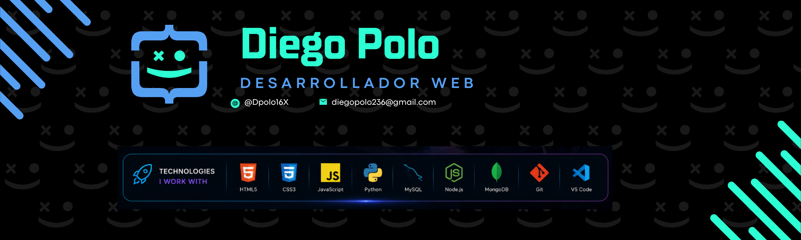

<!-- BANNER PRINCIPAL -->

 

<!-- TÍTULO ANIMADO -->

<!-- BADGES DE ESTADO -->

  
  
  

---

##  &nbsp; About Me

name: Diego Polo
location: Colombia 🇨🇴
education: Systems Engineering — 4th Semester

current focus:
  - Node.js & REST APIs
  - MongoDB & Database design
  - Building full-stack projects
    
stack:
  - JavaScript, HTML, CSS
  - Python
  - MySQL
  - Git & GitHub
    
interests:
  - Web Development
  - Creative coding
  - Problem solving
    
hobbies:
  - 🎮 Gaming
  - 🎵 Music

 

- 🌱 &nbsp;Currently deepening my knowledge in **Node.js** and **MongoDB**
- 💻 &nbsp;I build web projects using **JavaScript, Python, SQL** and modern databases
- 🚀 &nbsp;Passionate about creating projects that sharpen my **problem-solving** skills
- 👯 &nbsp;Looking to **collaborate** on open source projects and learn from other devs
- 💬 &nbsp;Ask me about **web dev, programming fundamentals or databases**
- 📫 &nbsp;Reach me at: **[diegopolo236@gmail.com](mailto:diegopolo236@gmail.com)**

---

## 🛠️ &nbsp; Tech Stack

### Languages

  
  
  
  

### Databases

  

### Tools & Workflow

  
  
  

### 🌱 &nbsp; Currently Learning

  
  

## 🌐 &nbsp; Connect With Me

---

### 💡 &nbsp; *"Code is not just syntax — it's how ideas come to life."*

